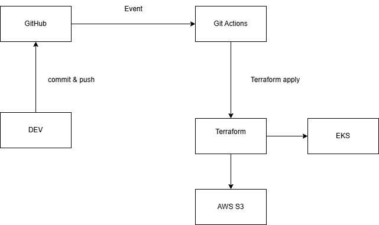

# Automação Terraform

O objetivo é automatizar o processo de criação e manutenção do ambiente para execução dos projetos de Software da Mr. Fusion Solutions.

---

## 📌 Premissas do Projeto

Para o desenvolvimento do projeto, foram levantadas as seguintes premissas:

- Utilizar o Terraform como ferramenta de Infraestrutura como Código (IaC)
- O cluster Kubernetes deve ser criado utilizando o serviço Amazon EKS
- O projeto deve ser o mais simples e reaproveitável possível
- Toda alteração na branch `main` do repositório deve disparar a pipeline automaticamente
- Existirá apenas um cluster Kubernetes
  - Ambientes de desenvolvimento, homologação e produção serão separados por *namespaces*

---

## 🧱 Estrutura da Solução

A arquitetura do projeto está representada abaixo:

## 🧰 Tecnologias Utilizadas

- AWS
- Amazon S3
- Amazon EKS
- AWS CLI
- Terraform
- AWS Provider
- Terraform AWS VPC Module
- Terraform AWS EKS Module
- GitHub
- GitHub Actions

---

## 🎯 Motivações

### Terraform
Permite Infraestrutura como Código, garantindo automação, rastreabilidade e reprodutibilidade do ambiente.

### Amazon EKS
Facilita o gerenciamento de clusters Kubernetes sem a necessidade de administrar diretamente o control plane.

### S3
Utilizado como backend remoto para armazenar o state do Terraform com segurança e versionamento.

### GitHub Actions
Responsável pela automação da pipeline CI/CD, executando validações e apply do Terraform.

### AWS CLI
Ferramenta de suporte para interação e automação com os serviços AWS.

---

## 🚀 Pipeline

A pipeline será acionada automaticamente sempre que houver alterações na branch `main`.

Ela será responsável por:

- `terraform fmt`
- `terraform validate`
- `terraform plan`
- `terraform apply`